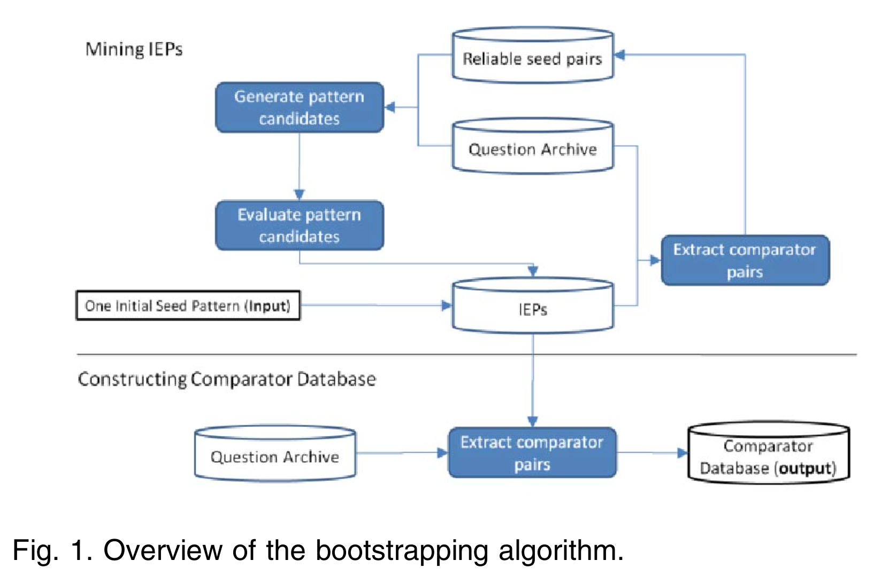

### I tried to implement the method proposed by:

[Jindal, N., & Liu, B. (2006). Identifying comparative sentences in text documents. *Sigir*, 244. http://doi.org/10.1145/1148170.1148215](https://github.com/hy3440/diffSimilarTech/blob/master/Related%20Papers/Identifying%20comparative%20sentences%20in%20text%20documents.pdf)

1. Use [83 key words and key phrases](https://github.com/hy3440/diffSimilarTech/blob/master/Related%20Papers/comparative-lexicon.pdf) to extract sentences: [1415 comparative sentences in total 6314 sentences (1219 posts)](https://github.com/hy3440/diffSimilarTech/blob/master/Data/data.txt)
2. Use the words that are within the radius of 3 of each keyword in the sentence as a sequence. Each word is then replaced with its POS tag. Generate CSR rules.
3. However, requires manually annotated training corpus.
4. [Li et al. (2013)](https://github.com/hy3440/diffSimilarTech/blob/master/Related%20Papers/Comparable%20Entity%20Mining%20from%20Comparative%20Questions.pdf) suspect that their rules might be too specific and overfit their small training set (about 2,600 sentences).

### I found four new related papers:

1. [Li, Y., Jia, B., Guo, Y., & Chen, X. (2017). Mining User Reviews for Mobile App Comparisons. *Proceedings of the ACM on Interactive, Mobile, Wearable and Ubiquitous Technologies*, *1*(3), 1–15. http://doi.org/10.1145/3130935](https://github.com/hy3440/diffSimilarTech/blob/master/Related%20Papers/%20Mining%20User%20Reviews%20for%20Mobile%20App%20Comparisons%20.pdf):
   * App aliases: e.g. *Facebook* -> *fb*
   * Comparative patterns:  

CV: comparative verbs, e.g. prefer, recommend

CIN: comparative prepositions, e.g. than, over

APP: app references, including app names and aliases, e.g. facebook, fb	

2. [Park, D. H., & Blake, C. (2012, July). Identifying comparative claim sentences in full-text scientific articles. In *Proceedings of the Workshop on Detecting Structure in Scholarly Discourse* (pp. 1-9). Association for Computational Linguistics.](https://github.com/hy3440/diffSimilarTech/blob/master/Related%20Papers/Identifying%20Comparative%20Claim%20Sentences%20in%20Full-text%20Scientific%20Articles.pdf):

   * 35 semantic and syntactic features + classifier (e.g. NB, SVM, BN)	

3. [Li, S., Lin, C.-Y., Song, Y.-I., & Li, Z. (2013). Comparable Entity Mining from Comparative Questions. *IEEE Trans. Knowl. Data Eng.*](https://github.com/hy3440/diffSimilarTech/blob/master/Related%20Papers/Comparable%20Entity%20Mining%20from%20Comparative%20Questions.pdf):

   * Focus on comparative questions

   * Pattern Evaluation: whether a pattern is reliable

   * Weakly supervised IEP mining approach: bootstrapping algorithm

     

4. [Xu, K., Liao, S. S., Li, J., & Song, Y. (2011). Mining comparative opinions from customer reviews for Competitive Intelligence. *Decision Support Systems*, *50*(4), 743–754. http://doi.org/10.1016/j.dss.2010.08.021](https://github.com/hy3440/diffSimilarTech/blob/master/Related%20Papers/Mining%20comparative%20opinions%20from%20customer%20reviews%20for%20Competitive%20Intelligence.pdf):

   * Comparative relation extraction using a two-level CRF with unfixed interdependencies
   * Only processed 1347 selected customer reviews

